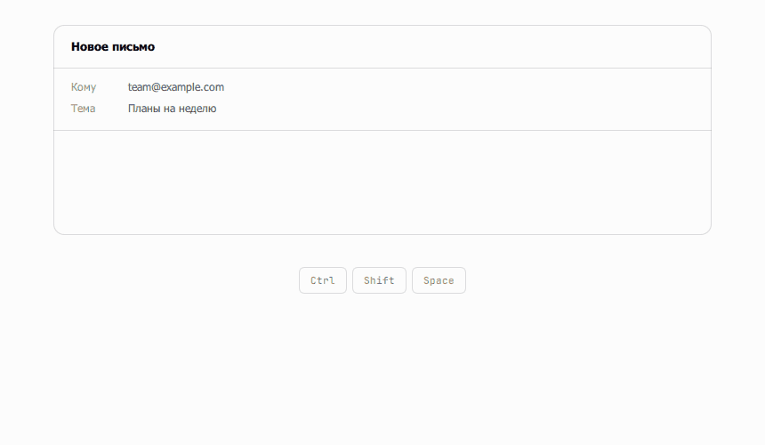
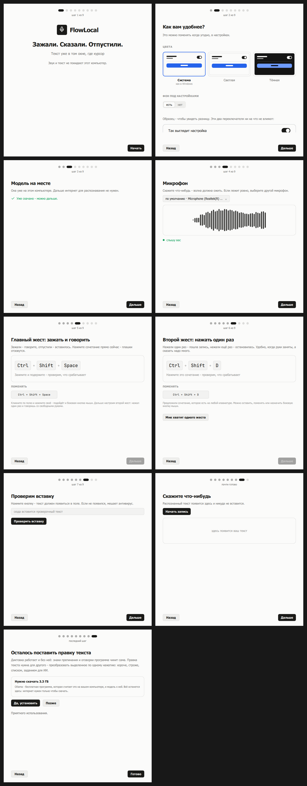
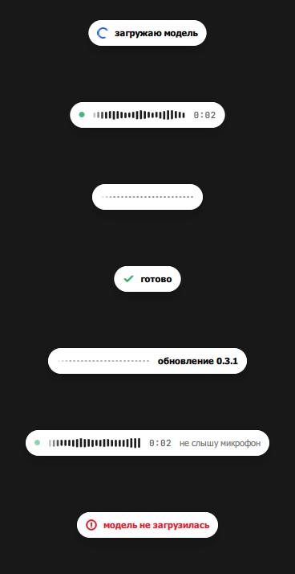
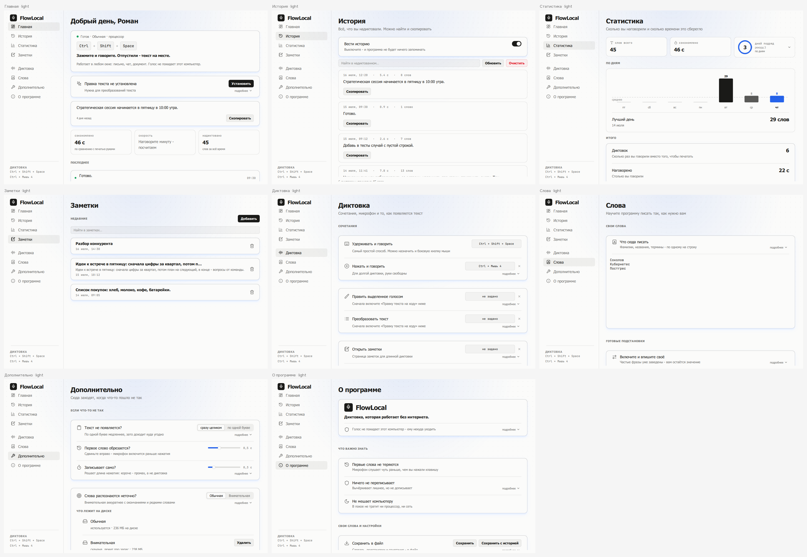

# FlowLocal

**Зажали клавишу. Сказали. Отпустили. Слова уже в том окне, где вы печатали.**

Бесплатная локальная замена [Wispr Flow](https://wisprflow.ai) для Windows, с
открытым кодом. Звук и текст не покидают компьютер: ни аккаунта, ни облака, ни
подписки.

<p align="center">
  <a href="https://github.com/romankandeevy/flowlocal/releases/latest"></a>
  
  
  <a href="https://github.com/romankandeevy/flowlocal/actions/workflows/tests.yml"></a>
  
</p>

<p align="center">
  <picture>
    <source media="(prefers-color-scheme: dark)" srcset="tools/demo_dark.gif">
    
  </picture>
</p>

<p align="center">
  <sub>Пилюля настоящая, волна настоящая, распознавание настоящее: 5 секунд
  речи за 0.22 с на процессоре, вместе со знаками препинания и «10:00». Звук
  берётся из <code>test.wav</code>, а не с микрофона, чтобы
  <a href="tools/demo_gif.py"><code>tools/demo_gif.py</code></a> давал один и
  тот же результат на любой машине; окно почты поддельное - настоящее не снять,
  не сняв заодно чужую переписку.</sub>
</p>

<p align="center">
  <sub><a href="README.en.md">English version</a></sub>
</p>

---

## Оглавление

[Почему не Whisper](#почему-не-ещё-одна-диктовка-на-whisper) ·
[Установка](#установка) ·
[Как пользоваться](#как-этим-пользоваться) ·
[Что умеет](#что-она-умеет) ·
[Настройки](#настройки) ·
[Как устроено](#как-это-устроено) ·
[Чего не умеет](#чего-она-не-умеет) ·
[Тесты](#тесты) ·
[Что дальше](#что-дальше) ·
[Лицензия](#лицензия)

---

## Почему не ещё одна диктовка на Whisper

Потому что Whisper хорош не на всех языках, а локальные диктовки почти все
сделаны на нём.

FlowLocal распознаёт **[GigaAM](https://huggingface.co/ai-sage/GigaAM)** (MIT,
SberDevices) - модель, обученную на 700 000 часах русской речи. По карточке
модели она ошибается **втрое реже Whisper на русском** (8.4% против 25.1% по
доменам), весит 236 МБ вместо 1.6 ГБ и **не выдумывает текст на тишине**:
у неё нет генератора, которому надо что-то сказать в паузу. Никаких «Спасибо за
просмотр!» посреди раздумья.

Видеокарта не нужна. На процессоре 8 секунд речи превращаются в текст примерно
за 0.7 с, а с разбором на ходу ждать почти не приходится вовсе.

> **Честная оговорка.** Цифры выше - из карточки модели, не наши, и делать вид,
> что мы их померили сами, мы не будем. Свой стенд (`tools/bench_asr.py`) меряет
> точность, задержку, память и место на диске, но живых записей ему не давали:
> решение о GigaAM принято и подтверждено ежедневной работой. Верьте
> направлению, а не десятым долям.

<details>
<summary><b>А если видеокарта всё-таки есть</b></summary>

<br>

Коротко: скорее всего она не поможет, и мы это замерили.

**DirectML** - кнопка «Ускорить на видеокарте» на странице «Дополнительно». Она
скачает нужное, подменит часть распознавания и **замерит вашу машину до и
после**. Стало быстрее - оставит, стало медленнее - вернёт процессор и покажет
обе цифры. Работает на любой карте с DirectX 12: NVIDIA, AMD, Intel, встроенной.

Замер на RTX 5060 (GigaAM v3 e2e-rnnt int8), медиана из пяти прогонов:

| Длина записи | Процессор | Видеокарта |
|---|---|---|
| 3 с | **0.11 с** | 0.28 с |
| 8 с | **0.24 с** | 0.32 с |
| 12 с | 0.36 с | **0.34 с** |
| 20 с | 0.64 с | **0.41 с** |
| 45 с | 1.73 с | **0.63 с** |

У видеокарты постоянная плата за вход около 0.27 с, зато дальше она почти не
растёт. Перелом - на двенадцати секундах. А диктуют люди фразами по три-восемь
секунд, да и те разбираются кусками ещё во время речи, - то есть в левой части
таблицы, где процессор быстрее вдвое. Отсюда и «скорее всего не поможет».

**CUDA** - для тех, кто хочет попробовать сам: поставьте `onnxruntime-gpu`
вместо `onnxruntime`, и программа подхватит её сама, ничего настраивать не надо.
При `устройство: авто` порядок такой: CUDA, потом DirectML, потом процессор.
В дистрибутив CUDA не входит и не войдёт - это полгигабайта библиотек NVIDIA
ради выигрыша, которого на коротких фразах нет.

</details>

**Моделей в списке две, а не девять.** «Обычная» и «Внимательная» - обе GigaAM,
обе русские, разница в аккуратности с окончаниями и редкими словами. Девять
вариантов - это витрина, а не выбор: человек, которому программу поставили, не
отличит CTC от RNN-T и не должен. Убранные модели достаются из истории репозитория.

---

## Установка

[**Скачать установщик**](https://github.com/romankandeevy/flowlocal/releases/latest)
- 70 МБ, без прав администратора и без окна UAC. Windows 10 или 11.

Подписи у него нет, поэтому SmartScreen один раз покажет синюю карточку:
«Подробнее» → «Выполнить в любом случае».

<details>
<summary>Из исходников</summary>

<br>

```powershell
git clone https://github.com/romankandeevy/flowlocal
cd flowlocal
pip install -r requirements.txt
python app.py           # первый запуск скачает GigaAM (236 МБ) в models/
```

Python 3.14 или 3.13. Фоном без консоли - `pythonw app.py`. Запуск вместе с
Windows - галочка в настройках или `python app.py --autostart on`.

</details>

Первый запуск открывает мастер из девяти экранов: приветствие, оформление,
модель, микрофон с живой волной, ваше сочетание, второе сочетание, проверка
вставки, пробная диктовка (текст покажем, никуда не вставим) и в конце
предложение доустановить правку текста. Кнопки «пропустить» нет намеренно:
диктовка, жеста которой вы не знаете, - это диктовка, которая не работает.

<p align="center">
  
</p>

---

## Как этим пользоваться

Зажмите **Ctrl+Shift+Space**, говорите, отпустите. Внизу экрана пилюля: живая
волна и таймер, пока говорите, потом `распознаю`, потом число слов - и текст
уже на месте.

<p align="center">
  <picture>
    <source media="(prefers-color-scheme: dark)" srcset="tools/preview_overlay_qt.png">
    
  </picture>
</p>

Сочетаний два, и это не переключатель режима - держите оба и выбирайте по
случаю:

| Жест | Как это | Когда |
|---|---|---|
| **Удерживать и говорить** | Зажали, сказали, отпустили - вставилось | Короткая фраза, реплика в чат |
| **Нажать и говорить** | Нажали, говорите со свободными руками, нажали ещё раз - остановились | Длинная мысль, письмо. **Esc** выбрасывает запись |

Любое из двух может быть кнопкой мыши, в том числе с модификатором
(`Ctrl+Мышь 4`). Левая и правая кнопки не принимаются намеренно: диктовка на
ЛКМ сделала бы мышь неуправляемой, и отменить настройку было бы уже нечем.

---

## Что она умеет

### Речь становится текстом

| | |
|---|---|
| **Разбор речи на ходу** | Программа начинает работать, пока вы ещё говорите. Ждать после клавиши почти не приходится, даже если диктовали пятнадцать минут. |
| **Чистка от бубнежа** | «Ну вот, короче, я думаю, типа, надо сделать» → «Я думаю, надо сделать». Без модели, без скачивания, без задержки - [как именно](#чистка-от-бубнежа-без-всякой-модели). |
| **Знаки препинания** | Запятые по правилам за сотые доли миллисекунды или по смыслу фразы - обученной моделью на 30 МБ, если скачаете её кнопкой. |
| **Слышит вопрос** | «Ты придёшь» и «Ты придёшь?» - одни и те же слова, разница только в голосе. Голос у нас есть: запись никуда не делась. |
| **Продолжение мысли** | Вторая фраза сразу за первой приклеится правильно: пробел и без заглавной посреди предложения. Не после точки, не в другом окне, не через полчаса. |

### Ваши слова, а не общие

| | |
|---|---|
| **Свои слова** | Фамилии, названия, термины. Чинятся по расстоянию Левенштейна с лестницей порогов, ваши падежи не трогаются. |
| **Подстановки** | Сказали фразу - вставился кусок текста. Целыми словами, без учёта регистра. |
| **Подстановки, которые находятся сами** | Программа замечает, что вы повторяете, и предлагает дать этому короткую фразу. Имя даёте вы: повтор машина найдёт, а «мой адрес» это или «рабочий» - знаете только вы. |
| **Технические термины** | «джейсон» станет JSON, «гитхаб» - GitHub, «пул реквест» - pull request. Сто терминов одним переключателем. |
| **Голосовые команды** | «с новой строки», «нажми энтер», «сегодняшняя дата» - переносы, Enter и подстановки, сказанные вслух. |

### Правка уже написанного

Этому нужна **Ollama**. Ставится одной кнопкой: программа скачает, установит,
заберёт модель и включит.

| | |
|---|---|
| **Преобразования текста** | Выделили, нажали, выбрали из списка: короче, строже, списком, задание для ИИ, техзадание. [Свои](#свои-преобразования) пишутся в настройках. |
| **Правка выделенного голосом** | Выделили, зажали, сказали «сделай короче» - выделенное заменилось. Указание - ваши слова, а не пункт меню. |
| **Понимание поправок** | «в пятницу, нет, в субботу» → «в субботу». |
| **Тон под приложение** | `outlook.exe` - строго, чат - свободно. |

### Куда едет текст

| | |
|---|---|
| **В активное окно** | Обычный путь: туда, где стоит курсор. |
| **В буфер обмена** | Своё сочетание. Для окон от администратора и полноэкранных игр, куда нажатия не доходят. |
| **В файл** | Своё сочетание. Мысль на ходу падает в конец выбранного файла, не отвлекая от работы. |
| **В заметки** | Страница в окне программы, куда диктуют длинно, не целясь в чужое поле. Сохраняется само, ищется по словам, приводится в порядок одной кнопкой. |
| **Отправка сообщения** | Перечислите программы, где диктовка заканчивается Enter (`telegram.exe`). Сказанное «нажми энтер» работает и так везде. |

### Когда что-то пошло не так

| | |
|---|---|
| **Отмена** | Своё сочетание. Стирает ровно вставленное - и только если вы после этого ничего не печатали. |
| **Повтор** | Последняя запись остаётся в памяти: если что-то пошло не так, распознайте её заново из трея. |
| **Запасной микрофон** | Выбранный отвалился - пишем с системного и говорим об этом на пилюле. |
| **Пауза музыки** | На время диктовки. Если музыка не играла - она и не заиграет: возвращаем только то, что сами остановили. |

### Ваши данные остаются вашими

| | |
|---|---|
| **История и статистика** | Каждая диктовка, клик копирует. Плюс график по дням и сколько времени это сберегло. |
| **Как вы говорите** | Любимое слово, присказка, часы пик, куда чаще всего диктуете. Считается здесь же, по своей истории; пока данных мало - программа молчит, а не выдумывает. |
| **Резервная копия** | Словарь, подстановки, тон и сочетания - в файл и обратно на другой машине. Загрузка **добавляет**, а не затирает. |
| **Забывание** | История хранится вечно, год, полгода или месяц - на выбор. |

### Сама программа

| | |
|---|---|
| **Английский интерфейс** | Переключается на лету, окно перерисовывается само. Распознавание остаётся русским: английский нужен, чтобы отдать программу тому, кто по-русски не читает. |
| **Обновления** | Программа сама видит новый выпуск и ставит его; список изменений - в окне «О программе», без интернета. |

### Чистка от бубнежа без всякой модели

Слово-паразит выдаёт не само слово, а **запятые вокруг него**. Просто удалить
«вот» нельзя: *«вот дом»* - обычная фраза. Но запятая ставится там, где человек
запнулся, а значит, запинки **уже размечены в тексте**. Читаем пунктуацию
вместо того, чтобы угадывать смысл, - и *«И вот, короче, я»* выдаёт себя, а
*«Вот дом»* остаётся нетронутым.

Это стоит ноль мегабайт, ноль миллисекунд и - главное - **не может потерять
ваши слова**: ничего не генерируется, вычёркиваются только размеченные куски.

Очевидное пробовали первым, и оно провалилось. Qwen3-0.6B int4 (1 ГБ, в
коробке) сделала из *«Вот дом, в котором я живу»* слово **«дом»**. Qwen3-1.7B с
рассуждением потратила 53 секунды и превратила *«Выручка выросла на 15% за
квартал»* в *«Выручка выросла за квартал»* - выбросила число, ради которого
фраза и существовала. Генератор по своему устройству может вернуть что угодно,
удалятор - не может. А вот самоисправления и тон без модели не сделать, и
ровно для них нужна Ollama.

### Разбор речи на ходу

Сказанное минуту назад уже не изменится - значит, ждать конца фразы, чтобы
начать работу, незачем. Программа разбирает речь, пока вы говорите, и к моменту
отпускания клавиши остаётся хвост в пару секунд. Ожидание перестаёт зависеть от
длины: пятнадцать минут готовы примерно за то же время, что и полминуты.

Побочное следствие оказалось важнее самой скорости: **модель теперь можно
выбирать по точности, а не по скорости** - пока идёт речь, успевает любая.

Выключается в «Диктовке» → «Разбирать речь на ходу».

### Свои преобразования

Готовых десять, и они закрывают почти всё: короче, строже, проще, списком,
письмом, по шагам, техзадание, только ошибки, задание для ИИ, на английский.
Ненужные прячутся переключателем, чтобы не искать своё среди чужого.

Свои пишутся в «Словах» → «Свои преобразования»: слева название, справа что
сделать с текстом - **словами, как объяснили бы человеку**. Указание уходит в
модель как есть; переписывать вашу формулировку под свой формат мы не будем.

---

## Настройки

Восемь дверей, обе темы, всё применяется по ходу правки. Кнопки «Применить» нет
намеренно - лишний шаг, о котором легко забыть.

<p align="center">
  <picture>
    <source media="(prefers-color-scheme: dark)" srcset="tools/preview_settings_qt_dark.png">
    
  </picture>
</p>

| Страница | Что там |
|---|---|
| **Главная** | Как диктовать, находки, сколько сберегли, последние диктовки |
| **История** | Всё надиктованное, клик копирует; вести или не вести, что забывать |
| **Статистика** | Итоги, «как вы говорите», куда диктуете, график по дням |
| **Заметки** | Длинная диктовка мимо чужих полей: список, поиск, уборка |
| **Диктовка** | Сочетания, микрофон, чистка, вставка, куда отдавать текст |
| **Слова** | Свои слова, подстановки, тон под приложение, преобразования |
| **Дополнительно** | Распознавание, вид, язык, ускорение на видеокарте, система |
| **О программе** | Резервная копия, нераспознанные записи, список версий, служебное |

**Настройки, которую видно только в `config.json`, для человека не существует.**
Это правило, а не пожелание: всё, что программа умеет, имеет место в окне.
Служебные пороги - исключение, они живут в комментариях `config.py`, потому что
их незачем крутить.

Оформление - дизайн-система **Korti**: две краски (бумага и чернила, остальное -
чернила поверх бумаги с прозрачностью), волосяные линии вместо заливок, синий
акцент только для по-настоящему особенного, зелёный и красный только для
состояния, движение на 120/180/280 мс по одной кривой и без пружин. Токены
лежат в `theme.py` одним источником правды и пробрасываются в QML, поэтому
смена темы перекрашивает окно на лету, а не пересобирает его.

Два осознанных отступления от системы, оба вынужденные:

- **Шрифт интерфейса - Onest, а не Hanken Grotesk.** В фирменном нет кириллицы
  (проверено по таблице cmap), и весь русский интерфейс превращался в ряды ▯▯▯.
  Onest повторяет геометрию и высоту строчных, но умеет кириллицу.
- **Точка записи зелёная, а не красная.** В Korti красный - «ошибка», и мигать
  им во время обычной диктовки значило бы врать.

---

## Как это устроено

| Файл | Зачем |
|---|---|
| `app.py` | склейка: хоткей, потоки, трей, конвейер запись → текст → вставка |
| `recorder.py` | микрофон, кольцевой пре-буфер, замер громкости для волны |
| `streaming.py` | разбор речи, пока человек ещё говорит |
| `transcriber.py` | onnx-asr: загрузка модели, процессор или видеокарта, прогрев |
| `models.py` | каталог моделей: размеры, языки, лицензии |
| `cleaner.py` | словарь, чистка от бубнежа, голосовые команды, тон и правка через Ollama |
| `punct_rules.py`, `punct_model.py` | знаки препинания: правилами и моделью |
| `intonation.py` | вопросительный знак по голосу |
| `transforms.py` | преобразования текста: готовые и свои |
| `insights.py` | разбор своей речи для «Статистики» |
| `inserter.py` | вставка в активное окно (буфер + Ctrl+V либо посимвольно) |
| `platform_api.py` | единственное место, где спрашивают «а какая это система» |
| `overlay_qt.py`, `qml/windows/Overlay.qml` | пилюля |
| `settings_qt.py`, `qml/windows/Settings.qml` | окно программы: как дела, история, статистика, заметки и настройки. Данные в Python, вёрстка в QML |
| `notes.py` | заметки: хранение, поиск, уборка |
| `i18n.py` | английский интерфейс; ключ перевода - сама русская строка |
| `theme.py`, `theme_qt.py` | токены Korti - один источник правды, мост в QML |

Пилюля не имеет права забирать фокус: заберёт - и ваш Ctrl+V уедет не в то
окно. Qt даёт это флагом `WindowDoesNotAcceptFocus`, который на Windows
разворачивается в `WS_EX_NOACTIVATE`. Данные на волну идут C++-сигналом внутри
процесса - ни IPC, ни сериализации, поэтому 60 кадров в секунду не стоят ничего.

---

## Чего она не умеет

- **Только Windows.** Порт на macOS идёт в ветке `port/macos`: Windows-только
  вызовы разведены по платформенным гардам, и импорт на маке уже проходит - но
  живого запуска не было ни разу. Честная оценка оставшегося - недели, а не
  выходные.
- Вставка через буфер перезаписывает нетекстовое его содержимое (файлы,
  картинки) - обратно восстанавливается только текст.
- В программу, запущенную от администратора, Windows не пустит наши нажатия,
  если сам FlowLocal запущен без прав (UIPI). Текст при этом не пропадает:
  он остаётся в буфере обмена, пилюля говорит «в буфере», и вставить его можно
  своим Ctrl+V.
- Поверх игры в полноэкранном эксклюзивном режиме пилюли не видно, и вставка
  туда обычно не проходит. На такой случай есть отдельное сочетание «диктовать
  в буфер».
- Отмена не сработает, если после вставки вы успели что-то напечатать. Это
  защита, а не недоделка: иначе Backspace съел бы ваш текст.

---

## Тесты

Девятнадцать проверок на каждый пуш
([`.github/workflows/tests.yml`](.github/workflows/tests.yml)). Они не трогают
ничего: ни микрофона, ни клавиатуры, ни сети, ни модели.

```powershell
$env:PYTHONIOENCODING="utf-8"   # иначе кириллица в консоли - мусор
python test_clean.py        # чистка, словарь и голосовые команды: половина случаев - ловушки
python test_stream.py       # разбор речи на ходу
python test_transforms.py   # преобразования: список, свои, спрятанные
python test_suggest.py      # находки по истории: 8 ловушек из 12
python test_join.py         # склейка диктовок и автоввод: 9 из 16 - ловушки
python test_insights.py     # разбор своей речи: молчит, пока данных мало
python test_backup.py       # выгрузка, загрузка и то, что загрузка не затирает
python test_intonation.py   # вопрос по интонации: 15 ловушек из 23
```

А эти шлют настоящие нажатия и двигают мышь, поэтому не в CI и не на машине,
за которой вы работаете:

```powershell
python test_insert.py both  # вставка в настоящий EDIT
python test_hotkey.py       # привязка, смена, захват, откат битого
```

Живой экземпляр программы на время прогона лучше закрыть - он перехватит
хоткеи у теста.

---

## Что дальше

Сделано: переезд на onnx-asr и GigaAM, чистка без модели, разбор речи на ходу,
знаки препинания, вопрос по интонации, преобразования, заметки страницей,
установщик, обновления из программы, Ollama одной кнопкой, находки по своей
истории, резервная копия, автоввод, склейка фраз, пауза музыки, диктовка в
буфер и в файл, английский интерфейс.

Своя LLM в коробке **пробовалась дважды и отвергнута дважды** - второй раз на
полном стенде из 20 случаев, где Qwen3-1.7B дала 10/20 против 18/20 у Ollama
и *потеряла слова в двух случаях*. Причина - замер, а не вкус.

Осталось: **macOS**. Импорт уже проходит, дальше - запуск, хоткеи и вставка, и
прежде чем платить за них неделями, пробы на живом Маке решат, возможно ли это
вообще. Взнос Apple $99 в год, как выяснилось, **не нужен**: он покупает
раздачу через скачивание, а этот проект так не раздаётся.

Это инструмент, которым автор пользуется каждый день, а не продукт, гоняющийся
за звёздами. Возможности появляются, когда стоят того дня, который на них уйдёт.

---

## Лицензия

[MIT](LICENSE). Шрифты - под OFL, в `assets/fonts/`. PySide6 под LGPLv3:
сборки идут папкой, Qt в них - заменяемые библиотеки, тексты лицензий приложены
в `licenses/`. Модель GigaAM - MIT от SberDevices, качается при первом запуске
и в репозиторий не попадает.

Шрифты интерфейса - Onest и JetBrains Mono, отдаются Windows только своему
процессу (`AddFontResourceEx` + `FR_PRIVATE`): в систему ничего не ставится, а
настольной программе нечего ходить на CDN, чтобы себя нарисовать.

«Замена Wispr Flow» здесь - сравнение для понятности, не более: проект не связан
с Wispr AI и ничего у них не заимствует.
